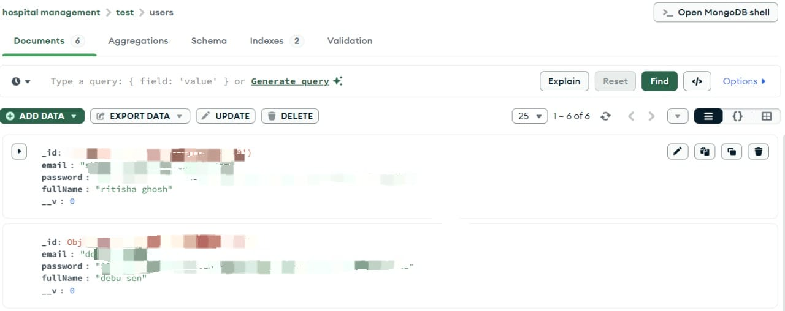

# Hospital Management System - Backend

This is the backend server for the Hospital Management System full-stack project.  
It handles API requests, authentication, database operations, and business logic.

##  Tech Stack
- **Node.js** (runtime)
- **Express.js** (web framework)
- **MongoDB** (database)
- **Mongoose** (ODM)
- **JWT** (authentication)

##  Project Structure
models/ # Mongoose models
routes/ # API routes
server.js # Main server entry
package.json # Dependencies

## 🔗 Related Repositories
- Backend: [Hospital Management Backend](https://github.com/Shrexya/Hospital-Management-frontend)

## 📸 Screenshots

**MongoDB Data Screenshot**  

**Terminal Output**  

